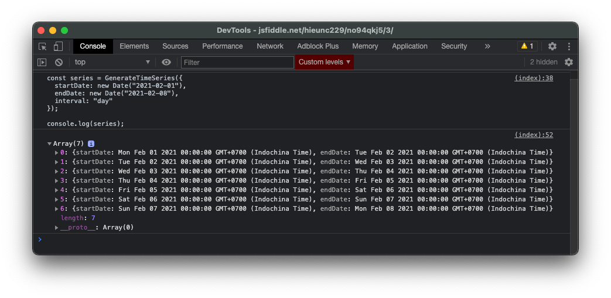

# ⏰ Time Series Generator

<a href="https://packagephobia.now.sh/result?p=time-series-generator"></a> <a href="https://www.npmjs.com/package/time-series-generator"></a> <a href="https://cdn.jsdelivr.net/npm/time-series-generator@latest/browser/index.min.js"></a>

`time-series-generator` is a library for generating time-series. Works on NodeJS, and browsers



A common use-case is to generate time-series for analytics. For example, number of active users each day, start from `Feb 12, 2021` to `Mar 12, 2021`. You can use `Time Series Generator` to generate a list of 28 dates (from `start` date to `end` date).

Table of content

1. [How to use](#1-how-to-use)
2. [Installation](#2-installation)
3. [Build and Test](#3-build-and-test)
4. [License](#4-license)
5. [Feedback and Contribution](#5-feedback-and-contribution)
6. [Changelog](#6-changelog)

---

## 1. How to Use

```js
// ES6
import TimeSeries from "time-series-generator";

// none-ES6
const TimeSeries = require("time-series-generator"); //add .default in some cases

const series = TimeSeries({
  startDate: Date,
  endDate: Date,
  interval: `millisecond` | `second` | `minute` | `hour` | `day` | `week` | `month` | `year`,
  intervalValue: number, // optional
  floorInput: boolean, // optional. `true` by default 
});

// series => [
//     { startDate: Date, endDate: Date },
//     { startDate: Date, endDate: Date },
//     .....
// ]
```

- `startDate`: begining of datetime period
- `endDate`: end of datetime period
- `interval`: output series based on given interval `millisecond`, `second`, ...
- `intervalValue`: the number value of `interval`, set to `1` by default. For example, `interval=second`, `intervalValue=3`, output will generate a list of date `each 3 second`.
- `floorInput`: floor date inputs to the nearest `interval` value (i.e when interval is "minute", set all "minute", "second", "millisecond" to 0)

Note: `startDate` can either be less than, or greater than `endDate`.

See [./tests/Generator.test.js](./tests/Generator.test.js) for examples

---

## 2. Installation

### Via npm (supported on browser and nodejs)

`time-series-generator` is available via `npm`. You can install using `npm` or `yarn`

```sh
# with npm
$ npm install time-series-generator --save

# with yarn
$ yarn add time-series-generator
```

### Via browser

```html

<!-- Embed latest version from jsdelivr (replace @latest with @{version number}) -->
<!-- P/s: When you use @latest, beware of caching when the version is changed-->
<script src="https://cdn.jsdelivr.net/npm/time-series-generator@latest/browser/index.min.js"></script>

<!-- Once the script is loaded, you can call window.GenerateTimeSeries -->
<script>
const series = GenerateTimeSeries({ ... });
</script>
```

---

## 3. Build and Test

Note: You should build before test. 

Run the following command (I'll use `yarn`, but also similar with `npm run`)

- To build as a npm module, run `yarn build`. Output files will located at `./dist`
- To build for browser,  run `yarn build-browser`. Output file will located at `./browser` (only `index.min.js`)

A test file is located on `./tests` directory. 
- Run test by run command `yarn test`

---

## 4. License

MIT

---

## 5. Feedback and Contribution

Please open a thread for feedback, question. Feel free to create PR for contribution.

--


## 6. Changelog

0.0.5 - added `floorInput` to floor date inputs to the nearest `interval` value
0.0.4 - initate
